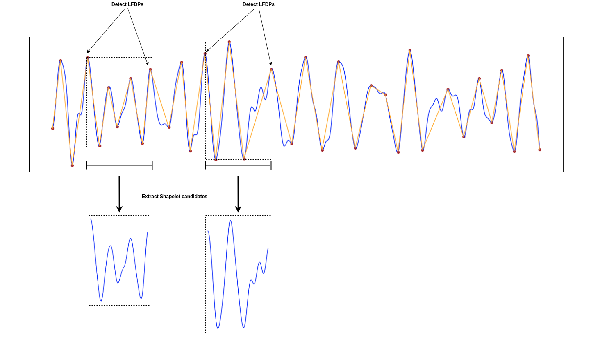

# A Fast Shapelet Selection Algorithm for Time Series Classification

## Abstract
<p align="justify">
Time series classification has attracted significant interest over the past decade. One of the promising approaches is shapelet based algorithms, which are interpretable, more accurate and faster than most classifiers. However, the training time of shapelet based algorithms is high, even though it is computed off-line. To overcome this problem, in this paper, we propose a fast shapelet selection algorithm (FSS), which sharply reduces the time consumption of shapelet selection. In our algorithm, we first sample some time series from a training dataset with the help of a subclass splitting method. Then FSS identifies the local farthest deviation points (LFDPs) for the sampled time series and selects the subsequences between two nonadjacent LFDPs as shapelet candidates. Using these two steps, the number of shapelet candidates is greatly reduced, which leads to an obvious reduction in time complexity. Unlike other methods that accelerate the shapelet selection process at the expense of a reduction in accuracy, the experimental results demonstrate that FSS is thousands of times faster than the original shapelet transformation method, with no reduction in accuracy. Our results also demonstrate that our method is the fastest among shapelet based methods that have the leading level of accuracy.
</p>

<p align="center">
  
</p>

This repository provides a python numpy implementation of the shapelet candidate selection algorithm from the paper
> Ji et al., „A Shapelet Selection Algorithm for Time Series Classification“.

See the [paper](https://www.sciencedirect.com/science/article/abs/pii/S1389128618312970) for a more detailed description.
# How to use

```python
shapelet_selection = ShapeletCandidateSelection(n_lfdp = n_lfdp)
shapelet_candidates = shapelet_selection.transform(data)
```
See the [demo](https://github.com/benibaeumle/A-Shapelet-Selection-Algorithm/blob/main/demo/demo.ipynb) for a more 
detailed example.

# License
Released under MIT License. The code was implemented by Benedikt Bäumle.
